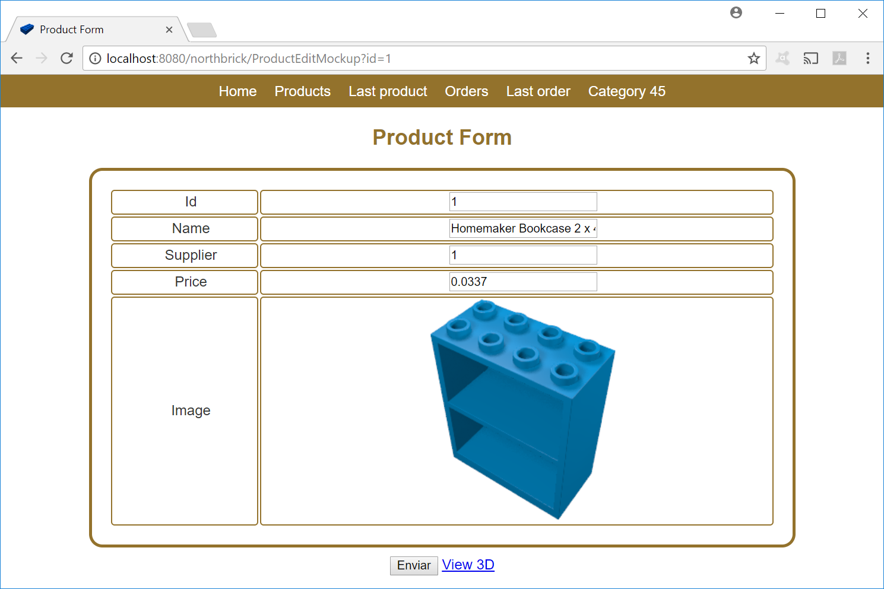

# Web Applications in Apache Tomcat

1.	Install Tomcat in the "P:" drive or in your pendrive. Instructions in [Tomcat Server](/CS/Tomcat).
2.	Modify HelloWorld Servlet to show: "Welcome to Software Engineering".
3.	Compile the [webapps/northbrick1/WEB-INF/classes/ProductDataMockup.java file](https://github.com/nicolasserrano/CS/blob/master/webapps/northbrick1/WEB-INF/classes/ProductDataMockup.java).
4.	Create a main file that prints the card information of the requested product in the format show below using the ProductDataMockup class. The requested product is a number from 0 to 3. Example:
```
$> java Test 1
Product id: 2
Name: Homemaker Cupboard 4 x 4 x 4
Supplier: 1
Company name: Brick Manufactures, Co.
Price: 0.0381
```
Notes: 
  - To write the main program you can use [this file](https://nicolasserrano.github.io/CS/JDK#jdk-primer-programa) as initial template or [this one](https://books.trinket.io/thinkjava2/chapter1.html#sec11).
  - To see an example of using the ProductDataMockup class you can see the [ProductListMockup class](https://github.com/nicolasserrano/CS/blob/master/webapps/northbrick1/WEB-INF/classes/ProductListMockup.java)
5. Insert before the information of the product the result of the `header()` function and after the information of the product the result of the `footer()` function. These functions are in the [Util class](https://github.com/nicolasserrano/CS/blob/master/webapps/northbrick1/WEB-INF/classes/Util.java) and used in the ProdctListMockup class. Include the card information between the &lt;PRE&gt; and &lt;/PRE&gt; tags. You can paste the output in an html file and see the result. You can include the style.css file to apply a better style. The result must be:

6.	Deploy the [northbrick1 application](https://github.com/nicolasserrano/CS/blob/master/webapps/northbrick1) in your Tomcat installation (installed in step 1).
7. Create the servlet ProductEditMockup that recives an argument with the identifier of a product an return a form where they are the data of that product. These data can be edited by the user. The modified data will be send to the servlet ProductSave (it is not neccesary to create this servelt a this moment). The servlet will appear as:


