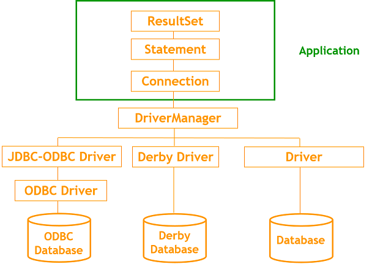

# MVC (JDBC and Web Aplications)

## JDBC architecture  
- [Architecture](https://docs.oracle.com/javase/tutorial/jdbc/overview/index.html#teir)  


## Web Applications


## API java.sql  
[API java.sql](http://docs.oracle.com/javase/6/docs/api/index.html?java/sql/package-summary.html)


## Other elements of JDBC

###   jdbc:odbc without DSN
We can avoid the definition of the DSN using the following syntax.

1. In a console application (with main() method):

```
String url=new String("jdbc:odbc:Driver={Microsoft Access Driver (*.mdb)};Dbq=" + "Libros.mdb");
```

It can be tested with [firstJDBC application](Java/JDBC/firstJDBC.java)
java firstJDBC "Driver={Microsoft Access Driver (*.mdb)};Dbq=Libros.mdb" "Select * from datos" autor titulo  

2. In a servlet:

```
ServletContext context = getServletConfig( ).getServletContext();
String url=new String("jdbc:odbc:Driver={Microsoft Access Driver (*.mdb)};Dbq=" + context.getRealPath("Libros.mdb"));
```


### Metadate  
- [ResultAppSQL](https://github.com/nicolasserrano/CS/blob/master/Java/JDBC/ResultAppSQL.java)
- [ExecuteSQL.java](https://github.com/nicolasserrano/CS/blob/master/Java/JDBC/ExecuteSQL.java)

### Derby  
```
F:\Java\db-derby-10.9.1.0-bin iniciar.bat
F:
SET JAVA_PC=F:\Java
SET JAVA_HOME=%JAVA_PC%\jdk1.6.0_04
SET PATH=%JAVA_HOME%\bin;%PATH%
set install=%JAVA_PC%\db-derby-10.9.1.0-bin
set classpath=%install%\lib\derbytools.jar;%install%\lib\derby.jar;%install%
cd %install%\demo\programs
java org.apache.derby.tools.ij

Para crear la base de datos Derby:
CONNECT 'jdbc:derby:firstdb;create=true';

Comandos:
ij> connect 'jdbc:derby:dbdetective';
ij> show tables;
ij> select * from user1.employee where Last_name like 'T%';
```

### Squirrel  
```
set path=C:\Java\Squirrel-sql-2.6.5a;%path%
squirrel-sql.bat
```

### Derby in server mode  
set the driver with file: derbynet.jar in CLASSPATH:
```
     set classpath=F:\Java\db-derby-10.9.1.0-bin\lib\derbynet.jar;%classpath%
```
start the server
```
java org.apache.derby.drda.NetworkServerControl start
```
Explianed in http://db.apache.org/derby/integrate/SQuirreL_Derby.html

Example of Squirrel with DerbyNet (server mode):
url:  jdbc:derby://localhost:1527/d:/folderpath//Java/ClientDB;create=true

---
[Edit](https://github.com/nicolasserrano/CS/edit/master/MVC.md)
<style>
div.container ul, div.container ol {
    padding-left: 1.4em;
}
</style>
